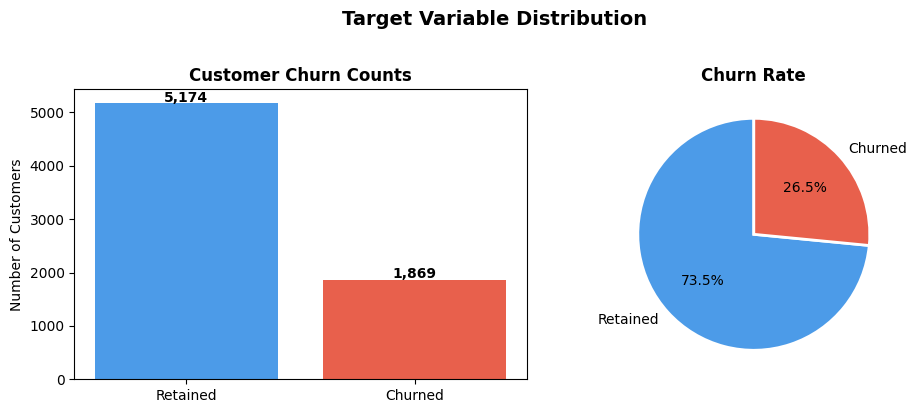
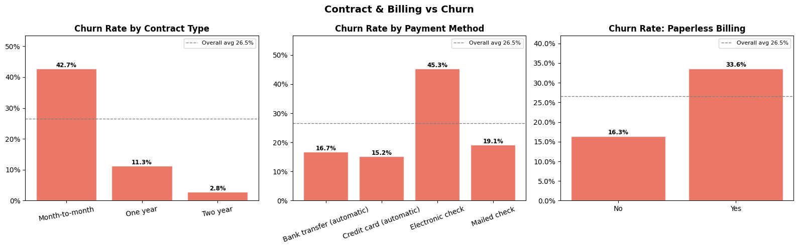

# Telco Customer Churn Prediction

End-to-end Data Science project focused on predicting customer churn for a telecommunications company.

This project demonstrates the full data science workflow including data cleaning, exploratory data analysis (EDA), feature engineering, machine learning modeling, and business insights.

---

# Project Overview

Customer churn is a critical problem for telecom companies. Acquiring new customers is significantly more expensive than retaining existing ones.

This project builds machine learning models to predict which customers are most likely to churn so companies can take proactive retention actions.

The project includes:

• Data cleaning and preprocessing
• Exploratory data analysis
• Feature engineering
• Feature selection
• Multiple machine learning models
• Hyperparameter tuning
• Cross-validation
• Churn risk segmentation
• Business insights

---

# Dataset

The dataset contains customer information from a telecom company including:

* Customer demographics
* Subscription services
* Contract type
* Billing information
* Churn label

Target variable:

`Churn Label`

---

# Project Structure

```
telco-churn-prediction/


README.md
requirements.txt
.gitignore
telco_churn_analysis.ipynb

data/
    telco_churn.csv

images/
    (all generated visualizations)

models/
    churn_model.pkl
```

---

# Exploratory Data Analysis

Key aspects explored in the dataset:

* Customer demographics
* Contract types
* Service usage
* Monthly and total charges
* Churn distribution

Example visualization:




---

# Machine Learning Models

The following models were trained and evaluated:

* Logistic Regression
* Random Forest
* Gradient Boosting
* Support Vector Machine

Techniques used:

* Stratified K-Fold Cross Validation
* Hyperparameter tuning (RandomizedSearchCV)
* Feature selection (SelectFromModel)

Evaluation metrics:

* Accuracy
* Precision
* Recall
* F1 Score
* ROC-AUC

---

# Churn Risk Segmentation

Customers were segmented based on predicted churn probability:

| Segment     | Probability Range |
| ----------- | ----------------- |
| Low Risk    | 0 – 0.30          |
| Medium Risk | 0.30 – 0.60       |
| High Risk   | 0.60 – 1.00       |

This segmentation allows businesses to target retention campaigns more effectively.

---

# Key Insights

Some of the most important drivers of churn:

* Contract type
* Tenure
* Monthly charges
* Internet service
* Technical support availability

Customers with month-to-month contracts and high monthly charges have a significantly higher probability of churn.

---

# Technologies Used

Python libraries:

* pandas
* numpy
* matplotlib
* seaborn
* scikit-learn
* joblib

---

# How to Run the Project

Clone the repository:

```
git clone https://github.com/selvord/telco-churn.git
```

Install dependencies:

```
pip install -r requirements.txt
```

Open the notebook:

```
telco_churn_analysis.ipynb
```

---

# Author

Aktilek Temirov
Data Science Student
